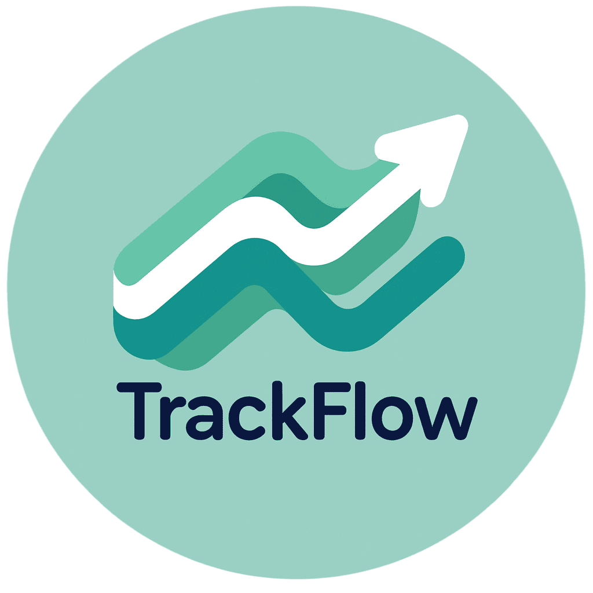
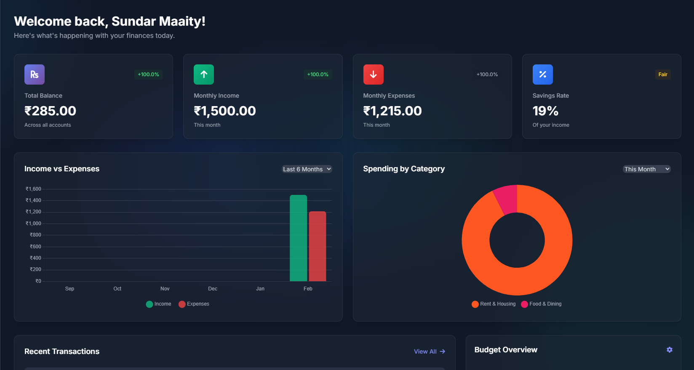
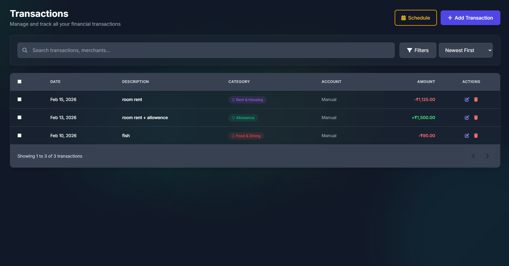
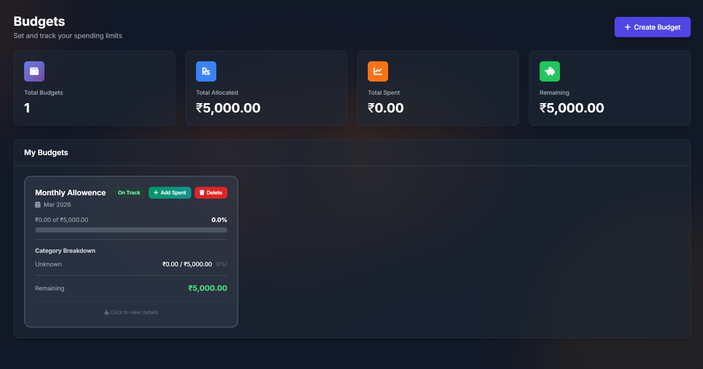
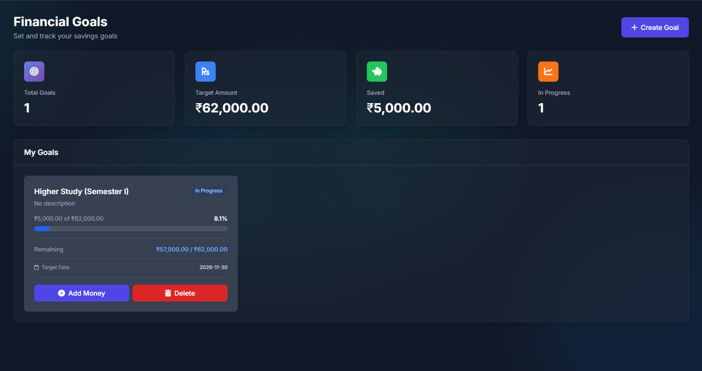
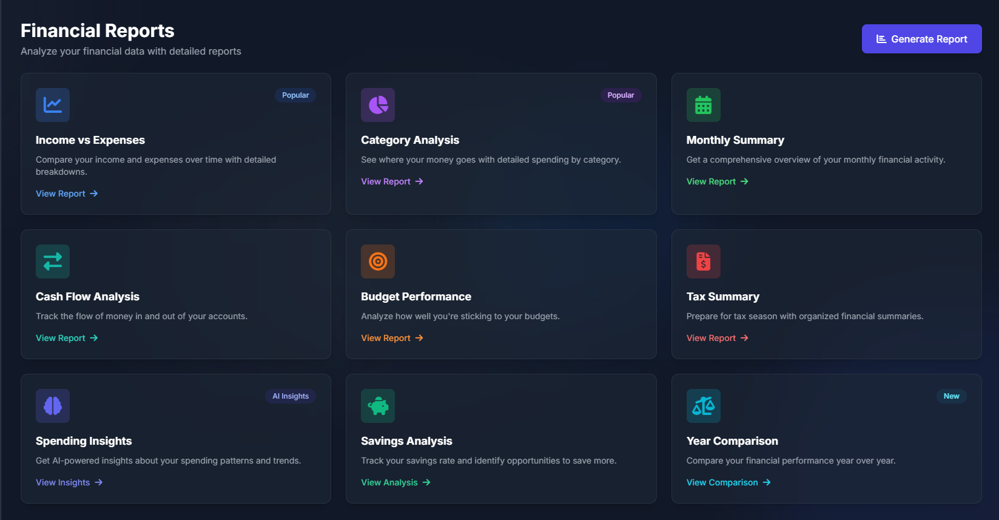
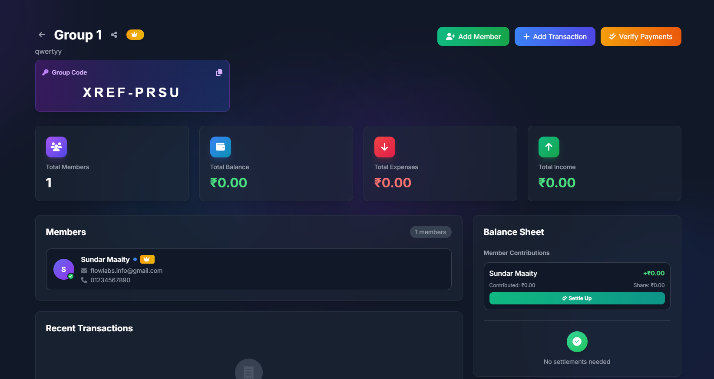
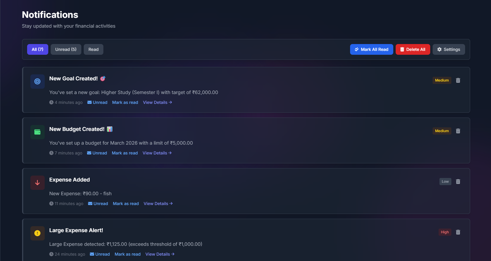

<div align="center">
  <br />
  <a href="https://trackflow.mooo.com" target="_blank">
    
  </a>
  
  <br />

  <a href="https://trackflow.mooo.com">
    
  </a>

  <p align="center">
    <strong>Finance clarity for everyday users and teams.</strong>
  </p>

  <p align="center">
  <a href="https://trackflow.mooo.com">
  
</a>

  <a href="#-quick-start">
    
  </a>

 <a href="https://github.com/PgiriDev/TrackFlow__Brainware_University">
  
</a>


  
  
  
  
</p>
</div>

---

## ✨ Why TrackFlow?

**TrackFlow** is a modern finance platform that helps users manage money with absolute clarity and speed. It combines daily transaction tracking with budgeting, goals, reports, group expense workflows, and high-level account security into one beautiful, responsive web experience.

> **🌍 Live Demo:** [https://trackflow.mooo.com](https://trackflow.mooo.com)

---

## 🚀 Core Features

<table>
  <tr>
    <td width="50%" valign="top">
      <h3> Expense Management</h3>
      <ul>
        <li>Add, edit, categorize, and search transactions instantly.</li>
        <li>Track inflow and outflow with clean historical records.</li>
        <li>Built for fast, frictionless everyday usage.</li>
      </ul>
    </td>
    <td width="50%" valign="top">
      <h3> Budget Planning</h3>
      <ul>
        <li>Create monthly or custom timeframe budgets.</li>
        <li>Define budget items and monitor spent vs. remaining.</li>
        <li>Improve financial discipline with visual spending cues.</li>
      </ul>
    </td>
  </tr>
  <tr>
    <td width="50%" valign="top">
      <h3> Financial Goals</h3>
      <ul>
        <li>Create savings goals with target amounts and timelines.</li>
        <li>Track progress automatically.</li>
        <li>Keep long-term plans visible and highly measurable.</li>
      </ul>
    </td>
    <td width="50%" valign="top">
      <h3> Reports & Analytics</h3>
      <ul>
        <li>Analyze financial performance with interactive charts.</li>
        <li>Review category-wise and period-wise spending behavior.</li>
        <li>Export-ready report views for sharing and auditing.</li>
      </ul>
    </td>
  </tr>
  <tr>
    <td width="50%" valign="top">
      <h3> Group Expense Workflow</h3>
      <ul>
        <li>Manage shared spending effortlessly.</li>
        <li>Track requests, payments, and settlement statuses.</li>
        <li>Perfect for trips, roommates, teams, and family finance.</li>
      </ul>
    </td>
    <td width="50%" valign="top">
      <h3> Auth & Security</h3>
      <ul>
        <li>Frictionless Google OAuth login support.</li>
        <li>Optional 2FA support for premium security.</li>
        <li>Trusted session and device-friendly auth flow.</li>
      </ul>
    </td>
  </tr>
</table>

---

## 📱 PWA App Experience

TrackFlow isn't just a website; it works as a fully installable **Progressive Web App (PWA)**. Users can add it directly to their home screens for a native app feel.

* **One-tap access:** Install prompt on supported browsers.
* **Standalone UI:** App-like experience without the browser clutter.
* **Speed:** Faster revisit experience with cached static assets.
* **Reliability:** Offline fallback support when the network drops.

> **Technical Implementation:**
> `Web App Manifest` • `Service Worker` • `PWA Install Script` • `Offline Fallback`

### Install as App Preview

<p align="center">
  
</p>

<p align="center">
  <em>Users can install TrackFlow directly from the browser prompt and launch it like a native app.</em>
</p>

---

## 💻 Tech Stack

<div align="center">
  
  
  
  
  
  
</div>

---

## 🖼 Visual Showcase

<p align="center">
  
</p>

| Expense Tracking | Budgets |
| :---: | :---: |
|  |  |

| Financial Goals | Reports |
| :---: | :---: |
|  |  |

| Group Expenses | Notifications |
| :---: | :---: |
|  |  |

---

## 🛠 Quick Start

### Prerequisites
* **PHP:** 8.2+
* **Node.js:** 18+
* **Database:** MySQL 8+
* **Tools:** Composer & NPM

### Installation

```bash
# 1. Clone the repository
git clone <your-repo-url>
cd Trackflow

# 2. Install dependencies
composer install
npm install

# 3. Environment setup
cp .env.example .env
php artisan key:generate

# 4. Set DB credentials in .env, then run migrations
php artisan migrate

# 5. Build frontend assets and start server
npm run build
php artisan serve
```

Open `http://127.0.0.1:8000` in your browser.

---

## ⚙️ Production Notes and OAuth Setup

### Production Checklist
- Keep the queue worker running for async jobs.
- Enforce HTTPS for OAuth and cookie security.
- Rebuild caches on every deploy:

```bash
php artisan optimize
```

### Google OAuth Setup
- Callback Route: `/auth/google/callback`
- Add this exact callback URL in your Google Cloud Console OAuth credentials.

---

## 📁 Project Structure

```text
TrackFlow/
├── app/                # Controllers, Models, Services, Jobs
├── config/             # App and service configuration
├── database/           # Migrations, seeders, factories
├── public/             # Public assets and images (Manifest, Service Worker)
├── resources/views/    # Blade views (auth, dashboard, landing)
└── routes/             # Web and API routes
```

---

## 📜 License

This project is distributed under the MIT License.

---

<p align="center"><strong>TrackFlow</strong> - Finance clarity for everyday users and teams.</p>
